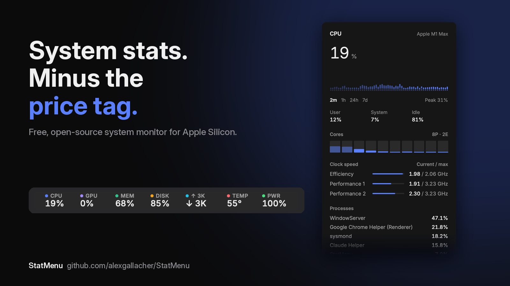
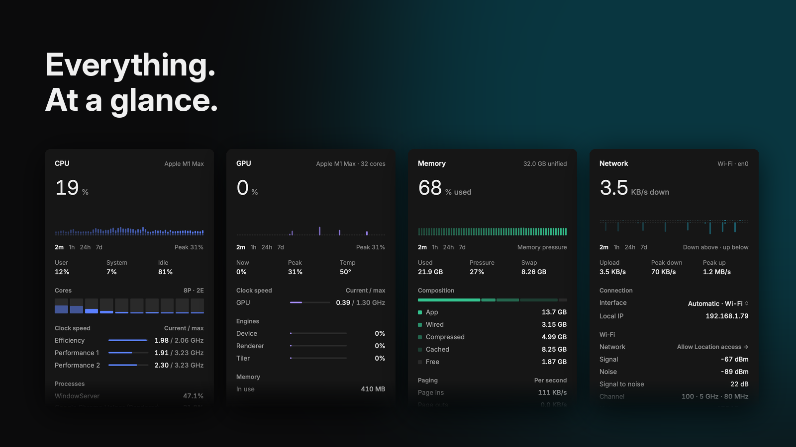
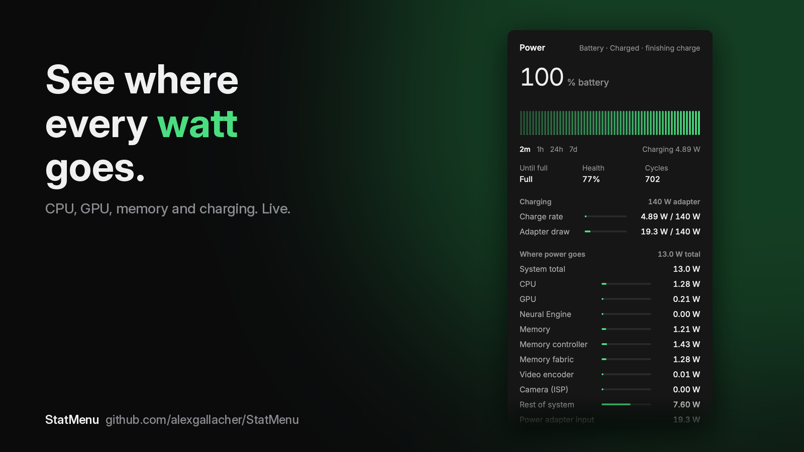

# StatMenu

A free, open-source system monitor for the macOS menu bar. Native Swift and SwiftUI, around 2% CPU while running.



## Install

**Requirements:** a Mac with Apple Silicon (M1 or later) running macOS 14 Sonoma or later.

### Quick install (Terminal)

Paste this into Terminal. It downloads the latest release into Applications and opens it:

```bash
curl -fsSL -o /tmp/StatMenu.zip https://github.com/alexgallacher/StatMenu/releases/latest/download/StatMenu.zip && ditto -x -k /tmp/StatMenu.zip /Applications && xattr -cr /Applications/StatMenu.app && open /Applications/StatMenu.app
```

### Manual install

1. Download **[StatMenu.zip](https://github.com/alexgallacher/StatMenu/releases/latest/download/StatMenu.zip)** from the latest release.
2. Unzip it and drag **StatMenu** into your **Applications** folder.
3. Open StatMenu. The first time, macOS will say it can't verify the developer, because StatMenu isn't notarized by Apple. To open it anyway:
   - Open **System Settings → Privacy & Security**, scroll down, and click **Open Anyway** next to StatMenu.
   - Or run `xattr -cr /Applications/StatMenu.app` in Terminal, then open it again.

StatMenu appears in your menu bar and starts automatically at login (you can turn that off in Settings).

## Updates

StatMenu checks GitHub for a new version once a day and shows **Update** at the bottom of its menus when one is available. You can also check any time in **Settings → About**, or turn on automatic installs.

Every release is signed. StatMenu only installs an update whose signature matches the key built into the app, so a tampered download is rejected.

## Features



- **CPU**: usage history, per-core load (efficiency and performance cores), clock speed per cluster against its maximum, top processes, load average, uptime
- **GPU**: utilization (device, renderer, tiler), clock speed, memory in use, temperature
- **Memory**: pressure, composition (app, wired, compressed, cached, free), swap, page-in/out and swap-in/out rates, top processes
- **Disks**: volume capacity, per-disk read/write rates, top processes by disk activity, and a picker to choose which disk to show
- **Network**: upload and download rates, Wi-Fi details (signal, noise, channel, link rate, standard, security), daily and monthly data usage, and a picker to choose the interface
- **Sensors**: temperatures and fan speeds
- **Power**: battery charge, health and cycles, charging rate against your adapter's rating, and where system power goes (CPU, GPU, Neural Engine, memory, and the rest of the system)
- **History**: hover any value for its own graph with min, average and max; charts switch between 2 minutes, 1 hour, 24 hours and 7 days, and long-term history survives restarts
- One combined menu bar item (fits beside the notch) or separate items per module
- Light and dark mode, °C or °F, launch at login



## Privacy

StatMenu collects nothing. The only network request it makes is the daily update check to GitHub's public releases API. The Wi-Fi network name needs Location access (a macOS rule); StatMenu uses it only to read the network name and never reads your location.

## Build from source

Needs Xcode Command Line Tools.

```bash
./scripts/build.sh            # builds build/StatMenu.app
./scripts/build.sh --install  # also copies it to /Applications and launches it
```

### Publishing a release (maintainers)

```bash
swift scripts/keygen.swift       # once: creates the signing key in your Keychain
./scripts/release.sh 1.1          # bumps the version, builds, signs and publishes the GitHub release
```

Forks: set `StatMenuRepository` and `StatMenuUpdatePublicKey` in `Resources/Info.plist` to your own repository and key.

## Notes

- Clock speeds, power and some temperatures come from undocumented macOS interfaces (IOReport, SMC, IOHID), the same approach other open-source monitors use. They may change between macOS releases.
- Sensor and power names are shown only where their meaning is widely agreed; anything else is listed under the name the hardware reports.
- Data usage only counts traffic while StatMenu is running.

## Credits

Uses the [Inter](https://github.com/rsms/inter) typeface by Rasmus Andersson, licensed under the SIL Open Font License 1.1 (see `Resources/Fonts/OFL.txt`).
